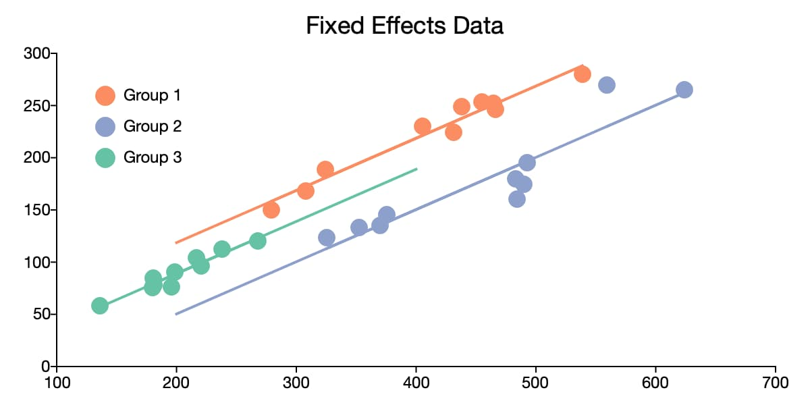

# Introduction

```{r, echo=FALSE}

```

## Purpose of This Site

The goal of this site is to have a place where you can look for examples of code. Think of this site as a log of all of the topics we cover in class and in lab sessions. I will make updates throughout the semester as we cover more advanced material. I hope this proves to be a helpful and beneficial resource and offer an easier to access format than the Google Doc. 

Let me know if any of this code doesn’t run correctly or if you have any questions or issues!

## Loading Data

The easiest way to load data into R and ensure you have the correct file path is to create a folder on your computer for each assignment and place the datasets directly into that folder.

1. Create a folder on your computer for each new analysis

2. Download your Data and move the file to your newly created folder

3. Then open RStudio

4. Click the project button in the top right corner

5. Click new project

6. Click existing directory

7. Click browse and find the folder that you created

8. Click create project

9. Once your new project opens, click the blank page with a green plus sign icon in the top left corner under the file option

10. Click R script to open a new script

11. You should also be able to see your data file in the bottom right window of RStudio, click the file and follow the options depending on the file type

12. Once your data is imported into R, the code that R automatically ran will be in the console window on the bottom left, copy and paste it to your fresh R script
  - For example, in Lab 1, my code looked like: `read_excel("Data/USstates.xlsx")`

13. Run this copy and pasted line of code whenever you open the R Project and you will never have to worry about complicated file pathing commands

14. I recommend using the assignment operator `<-` to give  your dataset a short and simple name like `df`, `dta`, or, if you are working with multiple datasets, name each something short and descriptive


# 9/23 | Lab I: Tidyverse & OLS Review

```{r, echo=FALSE}

```

```{r, include=TRUE, message = FALSE, warning = FALSE}
# Preparation
library(tidyverse)
library(readr)
library(readxl)
library(stargazer)
library(car)
```

## Join the data sets.
- Join the cases and vaccination data by date and state.
    - Case data: [United_States_COVID-19_Cases_and_Deaths_by_State_over_Time.csv](# https://data.cdc.gov/Case-Surveillance/United-States-COVID-19-Cases-and-Deaths-by-State-o/9mfq-cb36)

    - Vaccination data: [COVID-19_Vaccinations_in_the_United_States_Jurisdiction.csv](https://data.cdc.gov/Vaccinations/COVID-19-Vaccinations-in-the-United-States-Jurisdi/unsk-b7fc)

    - Other state variables: USstates.xlsx

- Add the USstates.xlsx data and limit your dataframe to the states listed in USstates.xlsx.  
- How do you know if your merge was successful?


```{r, warning=FALSE, message=FALSE}
## Loading Case Data
case <- read_csv("Data/United_States_COVID-19_Cases_and_Deaths_by_State_over_Time.csv")

## Loading Vax Data 
vax <- read_csv("Data/COVID-19_Vaccinations_in_the_United_States_Jurisdiction.csv")

## Joining Case & Vax
case_vax <- case %>%
  left_join(vax, by = c("submission_date" = "Date", "state" = "Location"))

## Adding in state variables
states <- read_excel("Data/USstates.xlsx")

## Joining all datasets to create df
df <- case_vax %>%
  filter(state %in% states$stateAbbr) %>%
  left_join(states, by = c("state" = "stateAbbr")) %>%
  janitor::clean_names() ## making variable names lowercase with underscores

## Checking for only states
count(tibble(unique(df$state)))

## View(df)

```

To use `janitor::clean_names()` above, be sure to install the `janitor` package with `install.packages("janitor")`

## Create and add the following variables to your dataframe density, deaths per capita, cases per capita and vaccinated percent.

- For a specific day, show the top five states ranked by deaths per capita and calculate the average vaccinated per capita and the mean, minimum and maximum deaths per capita.

```{r, warning=FALSE, message=FALSE}
## Creating Variables
df <- df %>% 
  mutate("deaths_pc" = 100000*new_death/pop2019, 
         "cases_pc"  = 100000*new_case/pop2019,
         "vaxed_pct"  = series_complete_12plus_pop_pct/100,
         "density"   = pop2019/(1000000*sq_miles))

## Filtering to specific day
df_day <- df %>%
  filter(submission_date == "10/1/2021")

## Top five states by deaths per capita
df_day %>%
  arrange(desc(deaths_pc)) %>%
  dplyr::select(submission_date, state, deaths_pc, cases_pc, vaxed_pct, density) %>%
  slice(1:5)

## Mean vaxed per capita and mean, min, max of deaths per capita
df_day %>%
  summarise(mean_vaxed = mean(vaxed_pct),
            mean_deaths = mean(deaths_pc),
            min_deaths = min(deaths_pc),
            max_deaths = max(deaths_pc))

```

## Estimate three regression models with deaths per capita on your selected day as the dependent variable.
- Your first model will have only Trump 2020 percent as an independent variable.
- Your second model will add vaccinated percent as an independent variable.
- Your third model will add density.
- Before you estimate the models, write down your expectations about what will happen in these models.

```{r, message=FALSE, warning=FALSE}
## Trump percent model
ols.1 <- lm(deaths_pc ~ trump2020_percent, data = df_day)
summary(ols.1)

## Trump and Vax model
ols.2 <- lm(deaths_pc ~ trump2020_percent + vaxed_pct, data = df_day)
summary(ols.2)

## Trump, Vax, and Density Model
ols.3 <- lm(deaths_pc ~ trump2020_percent + vaxed_pct + density, data = df_day)
summary(ols.3)
```

The results of `ols.1`, using October 1st, 2021 as the day, indicate that area with higher support for Donald Trump have more deaths per capita, specifically, a one percentage increase in Trump's 2020 vote share, on average, increases deaths per capita by 1.6. This is a classic case of omitted variable bias, however. Once we control for the percent vaxed in an area, the `trump2020_percent` loses statistical significance. We can see in the second model that the coefficient on the Trump vote share variable greatly decreases and is no longer statistically significant at conventional thresholds. `vaxed_pct` is statistically significant at the $p<.05$ level and indicates that a one percent increase in an areas vaccination rate corresponds, on average, with a 1.9 decrease in deaths per capita, holding `trump2020_percent` constant. This result stands even when controlling for an areas density as shown in model 3.

## Assess specific vaccines
- Create and add vaccinated percent by state for each of the Pfizer, Modern and Janssen (which is Johnson and Johnson) vaccines.
- Use _pop2019_ for population
- Use Series\_Complete\_Moderna\_18Plus, Series\_Complete\_Janssen\_18Plus and Series\_Complete\_Pfizer\_18Plus for the vaccination totals.

- Estimate a model in which deaths per capita is a function of all three vaccination rates.

- Explain what the results mean, especially in light of the results above for overall vaccination results.

- Explain how one would compare the efficacy of the individual vaccines (e.g., whether the Moderna vaccine works better than the Johnson and Johnson vaccine). Many answers would work here.

```{r, message=FALSE, warning=FALSE}
## Creating vaxed percent variables for different vaccines
df <- df %>% 
  mutate(vaxed_pct_moderna  = series_complete_moderna_18plus/(100*pop2019),
         vaxed_pct_jans  = series_complete_janssen_18plus/(100*pop2019),
         vaxed_pct_pfizer  = series_complete_pfizer_18plus/(100*pop2019))

## Filtering to day
df_day = df %>% 
  filter(submission_date == "10/1/2021")

## Running Model
ols.4 <- lm(deaths_pc ~ vaxed_pct_jans + vaxed_pct_moderna +
             vaxed_pct_pfizer, data = df_day)
summary(ols.4)
```

```{r echo = FALSE, results = 'asis', collapse = TRUE}
## Outputting Final Model
stargazer(ols.1, ols.2, ols.3, ols.4,
          keep.stat = c("n","ser", "rsq", "f"),
          report = "vcst", header = FALSE, type="html",
          column.labels = c("Model 1", "Model 2", "Model 3", "Model 4"),
          digits = 3, title = "Lab I OLS Results",
          dep.var.caption = "", dep.var.labels.include = FALSE)
```

The results are no longer statistically significance due to multicollinearity. There is a high degree of correlation between the rates each vaccine were administered which is contributing to the large standard errors. The p-value of the $F$-statistic tells us the probability that we would see a result this extreme given all of the coefficients on the vaccines are actually zero, reinforcing our findings above. 

This is not necessary for this lab, but to assess the efficacy of one vaccine over another, we could conduct an $F$ test. Remember, the formula for F-tests is: $$F_{q, N-k} = \frac{(R^2_{Unrestricted}-R^2_{Restricted})\setminus q}{(1-R^2_{Unrestricted}) \setminus (N-k)}$$

As an example, I will evaluate if $\beta_1 = \beta_2$ in the following model: $deaths_pc_{it} = \beta_0 + \beta_1jans_{it} + \beta_2moderna_{it} + \beta_3pfizer_{it} + \epsilon_i$ which is `ols.4` estimated above that examines the relationship between the rate of vaccination for each vaccine and deaths per capita in state $i$ and day $t$. We can do this manually, but `library(car)` makes it easy. See the code below:

```{r, warning=FALSE, message=FALSE}
## F Test 
linearHypothesis(ols.4, c("vaxed_pct_jans = vaxed_pct_moderna"))
```

We can see that the $p$-value is not statistically significant, meaning that we cannot reject the null hypothesis that $\beta_1$ is statistically significantly different than $\beta_2$.

## Optional Lab 1b

This lab is optional and just for some additional practice.

### Load the World Values Survey data from "Data/WV7_small.csv" and the CountryCode data from "Data/Country codes for WVS wave 7.csv".
The codebook for the World Values Survey data is available at 
http://www.worldvaluessurvey.org/WVSDocumentationWV7.jsp

The variables in WV_small were created as follows:

- Satisfaction with your life from 1 (completely dissatisfied) to 10 (completely satisfied) (*V23*)
- Income: a country-specific scale ranging from 1 (lowest income category) to 10 (highest income category) (*V239* in the dataset)
- Education: a scale ranging from 1 (no formal education) to 9 (a degree from a university) (*V248* in the dataset)
- Country: based on *V2* in the dataset.  See “Country codes for WVS wave 6.csv”
- Conservatism: self-identified political conservatism from 1 (most liberal) to 10 (most conservative) (*V95* in the data set)
- Male: a dummy variable indicating male (*V240*)
- Religious: Indicating how often the individual attends religious services ranging from 1 (almost never) to 7 (more than once a week) (this is a re-coding of *V145* that had the polarity reversed, but is harder to interpret)
- Marital: Marital status 1 = Married 2 = Living together as married 3 = Divorced 4 = Separated 5 = Widowed 6 = Single
- Survey year: year survey taken
- Birth year: respondent's year of birth

```{r, warning=FALSE, message=FALSE}
## World Values Dataset
wv <- read_csv("Data/WV7_small.csv")

## Country Codes
cc <- read_csv("Data/Country codes for WVS wave 7.csv")
```


### Join the country name from the CountryCode data to the World Values data.  The country code is *V2* in CountryCode and *B_Country* in the World Values data.  Create two data objects of the countries in and not in the World Values data. Display the first 10 countries for each list.

```{r, warning=FALSE, message=FALSE}
## Left Join
wv <- wv %>%
  left_join(cc, by = c("B_COUNTRY" = "V2"))

## Showing countries in
countries_in_wv <- tibble(unique(wv$country))
countries_in_wv[1:10,]

## Anti Join
countries_out <- cc %>%
  anti_join(wv, by = c("V2" = "B_COUNTRY")) %>%
  filter(V2 > 0)

## Countries not in wv
countries_out %>%
  slice(1:10)
```

### Using pipes, calculate the percent immigrant in every country. Show the highest 10 and lowest 10 countries. (Be sure to think through what the variable in the data set means.) 

```{r, warning=FALSE, message=FALSE}
## Recoding Immigrant Variable
wv$Immigrant <- wv$Immigrant-1

## 10 Highest
wv %>%
  group_by(country) %>%
  summarize(pct_imm = mean(Immigrant, na.rm=T), n=n())%>%
  arrange(desc(pct_imm)) %>%
  slice(1:10)

## 10 Lowest
## Percent immigrant in each country
wv %>%
  group_by(country) %>%
  summarize(pct_imm = mean(Immigrant, na.rm=T), n=n())%>%
  arrange(pct_imm) %>%
  slice(1:10)

```


### We're now going to give some examples of the kind of data we can calculate.  Think about how you would do this in Excel (but don't actually do it!) and then calculate in R. Calculate the percent of immigrants who are men, by country and show the highest and lowest 10 countries.

```{r, message=FALSE, warning=FALSE}
## 10 Highest
wv %>%
  filter(Male==1) %>%
  group_by(country) %>%
  summarize(pct_imm = mean(Immigrant, na.rm=T), n=n()) %>%
  arrange(desc(pct_imm)) %>%
  slice(1:10)

## 10 Lowest
wv %>%
  filter(Male==1) %>%
  group_by(country) %>%
  summarize(pct_imm = mean(Immigrant, na.rm=T), n=n()) %>%
  arrange(pct_imm) %>%
  slice(1:10)
```


### Group by marital status and country and show the percent of people in each category who are men.  Show the results for a country of your choice and briefly discuss what it means when the percentages in each category are not roughly 50 percent. Recall that the coding for the *Marital* variable is 1 = Married 2 = Living together as married 3 = Divorced 4 = Separated 5 = Widowed 6 = Single.

```{r, message=FALSE, warning=FALSE}
wv %>%
  group_by(country, Marital) %>%
  summarize(male_pct = mean(Male, na.rm=T), n=n()) %>%
  filter(country == "United States")

```


### Come up with your own alternatives: think about some possible subset of people and some information we have about them and see if you can write code to capture that information.

```{r, warning=FALSE, message=FALSE}
wv %>%
  group_by(country, Income) %>%
  summarize(imm_pct = mean(Immigrant, na.rm=T), n=n()) %>%
  filter(country == "United States")

```

# 9/30 | Lab II: Dummy Variables & Career Data

```{r, echo=FALSE}
knitr::include_graphics("lab2_image.png")
```

```{r, warning=FALSE,message=FALSE}
## Packages
library(knitr)
library(car)
library(AER)
library(stargazer)

## Data
load("~/GOVT702/Data/Ch6_Lab_CareerHappiness.RData")
```

We will use General Social Survey data for this lab.
The key variables we will use are

 - happy: 3 very happy, 2 pretty happy, 1 not too happy
 - married: 1 for currently married (based on dta$marital, which is 1 for married, 2 for widowed, 3 for divorced, 4 for separated, 5 for never married)
 - sex: 1 for men, 2 for women
 - edcat: 1 for less than high school, 2 for high school, 3 for some college and 4 for college graduate
 - race: 1 for white, 2 for black, 3 for other races (self-identified, first race mentioned)

## Use OLS to estimate the difference in happiness (the "happy" variable) for married versus unmarried people.  Then use the t test function to assess the difference in happiness by gender (see the Computing Corner in Chapter 6 of the book). Discuss similarities and differences in OLS model and t test function results

```{r}
## Difference in Happiness with OLS
model_1 <- lm(happy~married, data=dta)
summary(model_1)
confint(model_1)

## With t.test()
t.test(dta$happy[dta$married==1], dta$happy[dta$married==0])
```

## Use OLS with robust standard errors to estimate the difference in happiness for married and unmarried people.  Then use the t test function with unequal variances to assess the difference in happiness by marital status.  Discuss similarities and differences in OLS model and t test function results.

```{r}
## model_1 with Robust Standard Errors
coeftest(model_1, vcov. = vcovHC(model_1, type = "HC1"))

# t-test, without assuming equal variance
t.test(dta$happy[dta$married==1], dta$happy[dta$married==0], var.equal = FALSE)
```

## Create an interaction between married and age.  Estimate a model that explains happiness as a function of age and marital status, allowing for the age effect to differ according to marital status.   (For simplicity, we use only married and unmarried for marital status.)  What is the effect of age for unmarried people?  For married people?

```{r}
## Interaction Term
dum_interact <- dta$married*dta$age

## Model 2
model_2 <- lm(happy~age + married + dum_interact, data=dta)
summary(model_2)

## or
model_2b <- lm(happy~married*age, data=dta)
summary(model_2b)
```

The effect of age is $-0.00281$ for unmarried people and  $-0.00281 +  0.002350 =  -0.0004699$ for married people. The intercept is $2.13$ for unmarried people and $2.13 + 0.2109 = 2.3409$ for married people.

## Estimate separate models explaining happiness in terms of age for married and unmarried people.  Comment on similarities and differences compared to results immediately above for (i) the estimated effect of age and (ii) the intercept.

```{r}
## Model 3a
model_3a <- lm(happy~age, data=subset(dta, married==1))
summary(model_3a)

## and
model_3b <- lm(happy~age, data=subset(dta, married==0))
summary(model_3b)

```

The results here are the same as above: for unmarried people, the effect of age is $-0.00281$ and the intercept is $2.130$.

The effect of age for married people also the same: $-0.000469$, with an intercept of $2.3409$.


## Marianne Bertrand wrote an article called ``Work on Women’s Work is Never Done: Career, Family, and the Well-Being of College-Educated Women'' published in the *American Economic Review: Papers & Proceedings* 2013, 103(3): 244–250.  She analyzed the effect of careers and family on college-educated women. She defines a career variable that is 1 if someone's earnings are above the twenty-fifth percentile in the relevant year and age group. Estimate a model in which happiness is a function of career, being married and an interaction of career and married ("careermarried"). To match Betrand's analysis, limit the data to only to college educated (dta\$educat==4) women (dta\$sex==2). Interpret the estimated average happiness for the four types of women implied by this analysis.

```{r}
model_4 <- lm(happy ~ career*married, data=dta[dta$sex==2 & dta$educat==4,])
summary(model_4)

```

The four groups are unmarried women without careers, married women with careers, married women without
careers, and unmarried women without careers.

College-educated women that have no careers and are not married have an average happiness of $2.12$.

College-educated women with careers but not married have an average happiness of $2.12 + 0.09 = 2.21$.  

College-educated women with no career but are married have average happiness of $2.12 + 0.29 = 2.41$.  

College-educated women that are both married and have careers have average happiness of $2.12 + 0.092 + 0.29 -0.099 = 2.4$.

## The GSS provides a race variable (dta$race).  The variable equals 1 for white respondents, 2 for black respondents and 3 for everyone else.  Add race to the above model and interpret the coefficients related to race. Estimate another model with a different reference category and explain coefficients across the two models.

```{r}
## First Race Model with White as Reference
model_5 <- lm(happy ~ career*married + factor(race),
data=dta[dta$sex==2 & dta$educat==4,])
summary(model_5)

## Second Race Model with Other as the Reference Category
model_5b <- lm(happy ~ career*married + relevel(factor(race), ref = "3"),
data=dta[dta$sex==2 & dta$educat==4,])
summary(model_5b)

```

Both results indicated white college-educated women are both $0.16$ higher on the happiness variable than African-American college-educated women and $0.10$ higher than other college-educated women of other races. Even though the coefficient on the other race variables change across specifications, our interpretation of the results does not change; the change is due solely to the change in reference category.

## Estimate a model similar to the above, but for a different group of your choice (e.g., limit by race or gender or education) and feel free to include different covariates.

No wrong answers here (mostly)

This model explores the how commute times affect happiness. I specifically think that time commuting will - conditionally - lower a person’s happiness if it means they are away from their families. Because of this, I create an interaction term between commuting and marriage and estimate the effects.

```{r}
## Commuting Model on Adults
model_6 <- lm(happy ~ commute*married, data=dta[dta$age>18,])
summary(model_6)

```

My theory is not supported by this model. I found no significant effect for those who commute longer and no significant conditional effect of happiness for those who commute long hours and are married. I did find support that marriage in general makes a person happier, though this should not be considered a causal effect.

# 2/6 | Lab III: Panel Data

```{r, echo=FALSE}

```

```{r, include=TRUE, message = FALSE, warning = FALSE}
# Load packages used in this session of R
library(knitr)
library(tidyverse)
library(lubridate)
library(fixest)
library(stringr)
library(readxl)
```

In this lab we will estimate standard panel data models on covid policy and cases/deaths in U.S. states.  This is not a full-fledged analysis, but rather an initial exploration of the data that illustrates how fixed effects models work. We will also implement a difference-in-difference model to measure the effect of changing the time of an election on teacher salaries.

## Load the data from OxCGRT_latest.csv

Oxford provides data on covid deaths/cases and policy variables by day by state. For more background, see this [data archive](https://www.bsg.ox.ac.uk/research/research-projects/coronavirus-government-response-tracker#data) or this [story](https://www.nytimes.com/interactive/2020/11/18/us/covid-state-restrictions.html) that uses the data.

We will use a variable called _GovernmentResponseIndex_.  For details, see [this](https://www.bsg.ox.ac.uk/sites/default/files/2020-08/2020-08-06%20Oxford%20COVID-19%20Government%20Response%20Tracker%20expanded%20to%20US%20states%20PRESS%20RELEASE.pdf).  (And feel free to experiment with the other measures.)


## Data Organization
- Load the _OxCGRT_latest.csv_ data
- Limit it to U.S. states and DC (`CountryName == "United States" & RegionName!="NA" & RegionCode!="US_VI"`)
- Select the following variables: RegionName, RegionCode, Date, GovernmentResponseIndex_Average, ConfirmedCases and ConfirmedDeaths
- Add a variable to this data frame using the following code (this variable will help us when merging below)
```{r, warning=FALSE, message=FALSE}
## Loading Covid Data
covid <- read_csv("Data/OxCGRT_USA_latest.csv")

## Cleaning & Wrangling Covid Data
df <- covid %>%
  filter(CountryName == "United States" & RegionName!="NA" & RegionCode!="US_VI") %>%
  mutate(Date=ymd(Date), GovernmentResponseIndex = GovernmentResponseIndex_Average) %>%
  dplyr::select(RegionName, RegionCode, Date, GovernmentResponseIndex, ConfirmedCases, ConfirmedDeaths) %>%
  mutate("RegionCode" = str_replace_all(string = RegionCode, pattern = "US_", replacement = "" ))
```

- Show the first three variables of the first three lines of this data frame.
```{r}
head(df[1:3,1:3])
```

## Use the lag function in dplyr to create lagged variables for cases and deaths.  Also create "difference" (e.g., dCases) that is the change in cases for each state by date. Check to make sure it worked.

```{r}
## Creating lagged and change in cases
df2 <- df %>%
  group_by(RegionCode) %>%
  mutate(laggedcase = dplyr::lag(ConfirmedCases, order_by = Date),
         laggeddeaths = dplyr::lag(ConfirmedDeaths, order_by = Date),
         dcases = (ConfirmedCases-laggedcase),
         ddeaths = (ConfirmedDeaths-laggeddeaths))
```

## Merge the above data frame to data in _USstates.xlsx_
- Merge by state abbreviation
- Create percapita measures of change in deaths and cases (e.g. "deathsPC" = 10000*dDeaths/pop2019).

```{r}
## Reading in State Data
states <- read_excel("Data/USstates.xlsx")

## Joining and creating change in deaths and cases per capita
df3 <- df2 %>%
  left_join(states, by = c("RegionCode" = "stateAbbr")) %>%
  mutate(deaths_pc = 10000*ddeaths/pop2019,
         cases_pc = 10000*dcases/pop2019)
```

## Write in notation and estimate a pooled model of total cases as a function of state policy. Discuss possible bias.

The model is:

$$confirmed\_cases_{it} = \beta_0 + \beta_1average\_response\_index_{it} + \epsilon_{it}$$

```{r}
## Pooled Model
pooled_covid_model <- lm(ConfirmedCases~GovernmentResponseIndex, data = df3)
summary(pooled_covid_model)
```


## Write in notation and estimate a one-way fixed effect model where the fixed effect is state. Are you still worried about bias?

The model is:

$$confirmed\_cases_{it} = \beta_0 + \beta_1average\_response\_index_{it} + \alpha_{i} + \epsilon_{it}$$

```{r}
## One-Way Model
one_way <- feols(ConfirmedCases~GovernmentResponseIndex | RegionCode, data = df3,
                     vcov = "iid")
summary(one_way)
```

## Write in notation and estimate a two-way fixed effect model where the fixed effects are state and date. Does this model address the source of bias identified earlier? 

$$confirmed\_cases_{it} = \beta_0 + \beta_1average\_response\_index_{it} + \alpha_{i} + \tau_{t} + \epsilon_{it}$$

```{r}
## Two-way Model
two_way <- feols(ConfirmedCases~GovernmentResponseIndex | RegionCode + Date, data = df3,
                     vcov = "iid")
summary(two_way)
```

## Test a model with robust-clustered standard errors. Do the results change at all?

```{r}
## Two-way FE with robust-clustered se
two_way_robust <- feols(ConfirmedCases~GovernmentResponseIndex | RegionCode + Date, data = df3,
                     vcov = "twoway")
summary(two_way_robust)
```

Yes, the standard errors are much larger.

## Load in the Texas School Board Data and take a look at the variables. The next few questions are from exercise 5 in Bailey (2021). The basic thoery of the paper is that teachers unions will have less influence on school board members when turnout is greater since a wider swath of voters (non-teachers) will be voting. You can read the abstract below. 

Paper Abstract: Many governments in the United States hold elections on days other than national Election Day. Recent studies have argued that the low voter turnout that accompanies such off-cycle elections could create an advantage for interest groups. However, the endogeneity of election timing makes it difficult to estimate  its causal effect on political outcomes. In this paper, I develop a theoretical framework that explains how changes to election timing affect the electoral fortunes of organized interest groups. I test the theory examining the effects of a 2006 Texas law that forced approximately 20 percent of the state’s school by districts to move their elections to the same day as national elections.

```{r}
## Loading Data
load("Data/Texas_school_board.RData")
```

## Write in notation and estimate the pooled model of the effect of OnCycle on LnAvgSalary.

The model is:

$$LnAvgSalary_{it} = \beta_0 + \beta_1OnCycle_{it} + \epsilon_{it}$$

```{r}
## Pooled model
dta %>% 
  lm(LnAvgSalary ~ OnCycle, .) %>%
  summary()
```

## Write in notation and estimate a difference-in-difference model of the effect of OnCycle on LnAvgSalary. What is the key coefficient that we are interested in?

$$LnAvgSalary_{it} = \beta_0 + \beta_1CycleSwitch_{i} + \beta_2After_{t} + \beta_3(CycleSwitch_{i}\times After_{t}) + \epsilon_{it}$$

```{r}
## DiD model
dta %>% 
  lm(LnAvgSalary ~ CycleSwitch*AfterSwitch, .) %>%
  summary()
```

# 2/13 Lab IV | Project Runway

```{r, echo=FALSE}
knitr::include_graphics("lab4_image.png")
```

```{r, echo=FALSE, message = FALSE, warning = FALSE}
# Load packages used in this session of R
library(knitr)
library(tidyverse)
library(ggplot2)
```

Our goal is to visualize the difference between the population percent (_popPct_) and the survey percent (_svyPct_) for various age groups. We'll use the data in the table below (and of course, a full viz would include more subgroups). Create designs on how to present this information. Be ready to share concept and actual viz with the entire class. You can either work individually or in small groups. Do not include code with your visualizations. Instead, create an appendix that displays each code chunk at the end of the document. Make sure there are no warnings or messages displaying too.

Use the simulated data to make at least two plots: one in Base R and one in `library(ggplot)`. Then you can use a dataset of your choice for the last two visualizations or keep working with the fake data.

```{r, echo=FALSE, eval=TRUE, warning=FALSE, message=FALSE}
df <- data.frame("age" = c("18 to 29", "36 to 50", "51 to 64", "65+"),
                "popPct" = c(29, 21, 30, 20),
                "svyPct" = c(19, 21, 32, 28))

kable(df, caption = "Table: Population and Survey Percentages by Age Group")
```

## Base R Version

```{r, echo=FALSE}
knitr::include_graphics("fig1.png")
```

## `library(ggplot)` Version 1 

```{r, echo=FALSE}

```


## `library(ggplot)` Version 2
```{r, echo=FALSE}

```

## Alternative Plot of Your Choice

```{r, echo=FALSE}
knitr::include_graphics("fig4.png")
```


## Code Appendix

### Setup Code

```{r, echo=TRUE, eval=FALSE}
# Load packages used in this session of R
library(knitr)
library(tidyverse)
library(ggplot2)

opts_chunk$set(echo = TRUE)
options(digits = 2)
```

### Preparation Code

```{r, echo=TRUE, eval=FALSE}
df <- data.frame("age" = c("18 to 29", "36 to 50", "51 to 64", "65+"),
                "popPct" = c(29, 21, 30, 20),
                "svyPct" = c(19, 21, 32, 28))

kable(df, caption = "Table: Population and survey percentages by age group")
```

### Base R Plot Code

```{r, echo=TRUE, eval=FALSE}
Age18to29 <- c(19, 29)
Age36to50 <- c(21,21)
Age51to64 <- c(32, 30)
Over65 <- c(28, 20)
age_groups <- cbind(Age18to29, Age36to50, Age51to64, Over65)
barplot(age_groups, beside=T, xlab="Age Group", names.arg=
          c("18 - 29", "36 - 50", "51 - 64", "65+"), ylab="Percent",
        main = "Percent Surveyed and Percent in Population by Age Group",
        ylim = c(0,35), las=1)
legend("bottomleft",c("Surveyed %", "Population %"),
       fill=c("black", "light gray"), horiz=FALSE, cex=0.73, bg="white")
```

### `library(ggplot)` First Plot Code

```{r, echo=TRUE, eval=FALSE}

df %>% 
  mutate(Population = popPct, Survey = svyPct) %>%
  dplyr::select(-popPct, -svyPct) %>%
  pivot_longer(-age, names_to="Group", values_to="Percent") %>%
  ggplot(aes(x=age, y=Percent, fill=Group)) +
  geom_bar(stat="identity", position="dodge") +
  scale_fill_grey() + 
  theme_minimal() +
  labs(x = "Age Group", y = "Percent",
       title = "Population and Survey Sample Proportions by Age Group")

```

### `library(ggplot)` Second Plot Code

```{r, echo=TRUE, eval=FALSE}
df %>% 
  mutate(Population = popPct, Survey = svyPct) %>%
  dplyr::select(-popPct, -svyPct) %>%
  pivot_longer(-age, names_to="Group", values_to="Percent") %>%
  ggplot(aes(x=age, y=Percent, fill=Group)) +
  geom_bar(stat="identity", position="dodge") +
  coord_flip() +
  scale_fill_grey() + 
  theme_minimal() +
  labs(x = "Age Group", y = "Percent",
       title = "Population and Survey Sample Proportions by Age Group")

```

### Alternative Plot Code

```{r, echo=TRUE, eval=FALSE}
library(apyramid)

df %>% 
  mutate(Population = popPct, Survey = svyPct) %>%
  dplyr::select(-popPct, -svyPct) %>%
  pivot_longer(-age, names_to="Group", values_to="Percent") %>%
  mutate(age = as.factor(age)) %>%
  age_pyramid(data = ., age_group = "age", split_by = "Group",  
              count = "Percent", show_midpoint = FALSE) +
  scale_fill_grey() +
  theme_minimal() +
  labs(x="Age Group", y="Percent", fill=NULL, 
       title = "Percent Surveyed and Percent in Population by Age Group")
```

# 2/21 Lab V | 2SLS & Instrumental Variables

```{r, echo=FALSE}
knitr::include_graphics("lab5_image.png")
```

## Preparation

```{r, echo=TRUE, message = FALSE, warning = FALSE}

## Packages
library(haven)  ## Package to read Stata data
library(ivreg) ## Package to run 2sls
library(fixest) ## This package can also run 2SLS
library(tidyverse) ## For tidyverse commands
library(memisc) ## For table outputting


## Loading Data
hajj_public <- read_dta("Data/hajj_public.dta")
```

Do important life experiences influence political and social views?  In particular, does performing the Hajj pilgrimage to Mecca affect the views of pilgrims?  David Clingingsmith, Asim Ijaz Khwaja, and Michael Kremer (2009) analyze this question by using two-stage least squares to compare successful and unsuccessful applicants in a lottery used by Pakistan to allocate Hajj visas.

We will conduct pared-down models. The paper creates indices and implements additional statistical procedures to produce a broader and clearer picture. It is not a bad idea to read this paper to see how we can extend the methods we learn in class to your own work. I posted the paper on Canvas for your convenience. 

Data description

Variable  | 	Description
------------- | -------------
hajj2006 | Went on Hajj trip in 2006
success  | Won the lottery to have expenses covered for Hajj
ptygrp   |  Categorical variable indicating size of party for Hajj trip
smallpty |  1 if small party group, 0 otherwise
urban    |  1 if live in urban area, 0 otherwise
age      | Age
female   | 1 if female, 0 otherwise
literate | 1 if literate, 0 otherwise
x_s7q10  | _Natl affairs_:  How often do you follow national affairs in the news on television or on the radio? Binary: 0=Twice a week or less, 1=Several times a week or more
x_s14aq10 | _Religious_: Do others regard you as religious? Binary: 1=Religious, 0=Not Religious
x_s10bq4 | _OssamaIncorrect_: Do you believe goals Ossama is fighting for are correct?  Binary: 1=Not Correct at All/Slightly Incorrect, 0=Correct/Absolutely Correct
x_s7q12a | _GovtForce_: Govt should force people to conform to Islamic injunctions. Binary: 1=Agree Strongly/Agree, 0=Neutral/Disagree/Strongly Disagree 
x_s7q1 | _NatlInterest_ How interested would you say you are in national affairs? Binary: 0=Not interested, 1=Interested 
x_s3q3 | _Happy_: how happy are you? From 1 (not at all happy) to 4 (very happy).
x_s10eq2 | _GirlsSchool_: In your opinion, girls should attend school. Binary: 0=Disagree, 1=Agree
s10dq1 | _JobsWomen_: When jobs are scarce, men should always have more right to a job than women. Binary: 0=Generally agree, 1=Generally Disagree

More details on these and other variables are available in Appendix 3 of the paper. If you cannot access the \emph{Quarterly Journal of Economics} version, the SSRN version works as well.

## Estimate a basic OLS model with "Do others regard you as religious" as the dependent variable as a function of Hajj2006. Explain how there might be endogeneity.

```{r}
hajj_public %>%
  lm(x_s14aq10~hajj2006, data=.) %>%
  broom::tidy()
```

There may be endogeneity due to baseline bias caused by the religiosity of respondents. A more religious respondent may be more likely to go on a Hajj trip and be classified as religious by others. Going to church, like actually being religious, is also a factor that may be correlated with x and lurking in the error term.

## State the requirements of a good instrument and xplain how the "success" variable may satisfy these conditions for a good instrumental variable.

The two conditions, inclusion and exclusion, are:
$$Cov(X,Z)\ne0$$
&
$$Cov(Z,\epsilon)=0$$

The lottery is randomizes, which means it is not correlated with the error term, or anything else other than the treatment variable, in our model. Further, it meaningfully effects our key independent which is tested below.

## Use two different packages to estimate a 2SLS model of _Religious_ as a function of Hajj2006. You can use `library(AER)`, `library(ivreg)`, `library(fixest)` or any other package for estimating 2SLS models.

```{r}
## With library(ivreg)
hajj_public %>%
  ivreg(x_s14aq10~hajj2006 | success, data=.) %>%
  broom::tidy()
  
## With library(fixest)
hajj_public %>%
  feols(x_s14aq10 ~ 1 | hajj2006~success, data=., vcov = "iid") %>%
  broom::tidy()
```

## Show the first stage from the 2SLS model above with lm(). Explain the implications of the results.

```{r}
hajj_public %>%
  lm(hajj2006~success, data=.) %>%
  broom::tidy()

```

The t-score is `r hajj_public %>% lm(hajj2006~success, data=.) %>% broom::tidy() %>% filter(term=="success") %>% dplyr::select(statistic)` which is much higher than the 3 threshold. Our instrument meets in the inclusion condition.

## Add covariates for age, literacy, urban, group size and gender to the 2SLS model _Religious_ as a function of Hajj2006. What is different?  Which variables are included in the first stage?

```{r}
hajj_public %>%
  feols(x_s14aq10~age + literate + ptygrp + female + urban | 
          hajj2006 ~ success + age + literate + ptygrp + female + urban, 
        data=., vcov = "iid") %>%
  broom::tidy()

hajj_public %>%
  ivreg(x_s14aq10~hajj2006 + age + literate + ptygrp + female + urban | 
          success + age + literate + ptygrp + female + urban, data=.) %>%
  summary(diagnostics=TRUE)
```

## Run multiple 2SLS models with OssamaIncorrect, GovtForce, NatlInterest, Happy, GirlsSchool and JobsWomen variables as dependent variables. Use the list of covariates from earlier. If you want, try using a loop (but not necessary).

```{r, eval=FALSE}
## OssamaIncorrect
hajj_public %>%
  ivreg(x_s10bq4~hajj2006 + age + literate + ptygrp + female + urban | success +
                 age + literate + ptygrp + female + urban, data=.) %>%
  broom::tidy()


## GovtForce
hajj_public %>%
  ivreg(x_s7q12a~hajj2006 + age + literate + ptygrp + female + urban | success + 
                 age + literate + ptygrp + female + urban, data=.) %>%
  broom::tidy()


## NatlInterest
hajj_public %>%
  ivreg(x_s7q1~hajj2006 + age + literate + ptygrp + female + urban | success + 
                 age + literate + ptygrp + female + urban, data=.) %>%
  broom::tidy()

## Happy
hajj_public %>%
  ivreg(x_s3q3~hajj2006 + age + literate + ptygrp + female + urban | success + 
                 age + literate + ptygrp + female + urban, data=.) %>%
  broom::tidy()

## Girl School
hajj_public %>%
  ivreg(x_s10eq2~hajj2006 + age + literate + ptygrp + female + urban | success + 
                 age + literate + ptygrp + female, data=.) %>%
  broom::tidy()

## Jobs Women
hajj_public %>%
  ivreg(x_s10dq1~hajj2006 + age + literate + ptygrp + female + urban | success +
                  age + literate + ptygrp + female, data=.) %>%
  broom::tidy()
```

```{r}
## Loop

## DVs 
dvs <- c("hajj_public$x_s10bq4", "hajj_public$x_s7q12a", "hajj_public$x_s7q1", 
         "hajj_public$x_s3q3", "hajj_public$x_s10eq2", "hajj_public$x_s10dq1")

## Loop
for(i in 1:length(dvs)){
  model <- paste("model",i, sep="")
  m <- ivreg(as.formula(paste(dvs[i],"~hajj2006 + age + literate + ptygrp +
  female + urban | success + age + literate + ptygrp + female + urban")), data=hajj_public)
  assign(model,m)}

```

# 3/13 Lab VI | Experiments

```{r, echo=FALSE}
knitr::include_graphics("lab6_image.jpg")
```

## Preparation

```{r, include=TRUE, message = FALSE, warning = FALSE}
library(knitr)
library(haven)
library(tidyverse)
library(car)
library(memisc)
load("~/GOVT702/Data/EgyptProtests.RData")
```

Williamson and Malik (2020) used a survey experiment to examine the public response to how Egyptians responded to different framings regarding a protest in which protesters were killed by police.

All respondents were given the following statement: "Last year, police raided an apartment in 6 October City. During the raid, they killed 9 members of the Muslim Brotherhood." 

Respondents were assigned with equal probability to a control group that got no more information or one of three treatment groups that received additional information.

- Respondents in the first treatment group were provided a paragraph that justified the killings from the security forces perspective.

- Respondents in the second treatment group were provided a paragraph that criticized the killings from a human rights perspective.

- Respondents in the third treatment group were provided both the security forces and human rights perspectives.


Two outcomes were measured: 

- if respondents thought the police tactics were justified, and

- if the police should the police be held accountable for killing the nine men. So that both variables are coded in same direction, this variable is coded as 1 if the respondent gave a pro-police answer (saying the police did not need to be held accountable).

Data description

Variable  | 	Description
------------- | -------------
just_binary_main | 1 if the respondent said the police tactics were justified; 0 otherwise.
not_acc_binary_main | 1 if the respondent said the police should definitely or probably not be held accountable;  0 otherwise. We call this variable no-accountability
treat_b1  | 1 if respondent was given the pro-police paragraph
treat_b2  | 1 if respondent was given the human rights paragraph
treat_b3  | 1 if respondent was given both the pro-police and human rights paragraphs
sisi_vote | 1 if the respondent voted for Sisi
not_voteboycott | 1 if the respondent did not vote for some other reason than boycotting the election
opposition_vote_boycott | 1 if the respondent either voted for the opposition candidate or boycotted the election
education  | from 1 (no formal education) to 8 (graduate degree). Values from 6 to 8 went to college.
income | 1 = Less than 500 pounds per month, 2 = 500 to 1000 pounds per month, 3 = 1000 to 4000 pounds per month, 4 = 4000 to 10000 pounds per month, 5 = More than 10000 pounds per month
male| 1 for men, 0 otherwise
age_cat | age categories: 1 is less than 35, 2 is 35 to 50 and 3 is over 50.

[Published paper](https://journals.sagepub.com/doi/abs/10.1177/0022343320961835?journalCode=jpra) (paywalled) 

[Draft version of the paper](https://static1.squarespace.com/static/5b23cff07c9327b8cde5c995/t/5d5c3f1bc49f210001338d1f/1566326555630/Contesting+Repression+-+Website.pdf)

## Why is an experiment useful in this context?

Simply asking respondents if they agree or disagree with the police does not answer if and how different messages work.  If respondents were simply asked if they agree with the either the pro-police or human rights messages it may be difficult to separate out whether the message was persuasive or whether the respondent was predisposed to approve of the argument. 

## Is there evidence of balance in the treatment?  Why is this relevant? Check for balance of each treatment with respect to age category, gender, education, income, voting for Sisi and not voting for non-boycott reasons. Use two different procedures to conduct your balance tests. You do not need to use TOST!

```{r}
## Removing NAs
dta <- dta[is.na(dta$just_binary_main)==0 & is.na(dta$not_acc_binary_main)==0,]

dep_vars <- dta %>% 
  dplyr::select(age_cat, male, education, sisi_vote, not_voteboycott, income)

b_test <- lapply(dep_vars, function(bal) { 
  lm(bal ~ dta$treat_b1 + dta$treat_b2 + dta$treat_b3)})

## Extracting Slopes and P Values
slopes  <- round(sapply(b_test, function(x) x$coefficients), 2)
p <- round(sapply(b_test, function(x) {
            summary(x)$coefficients[,4]}), 2)

## Showing Results
balance_results = data.frame(b1= slopes[2,], b1.p = p[2,], 
                            b2= slopes[3,], b2.p = p[3,],
                            b3= slopes[4,], b3.p = p[4,]) 
balance_results
```

We can do the same with a loop.

```{r, eval=FALSE}
## DV Creation
dvs <- c("dta$age_cat", "dta$male", "dta$education", "dta$income",
         "dta$sisi_vote", "dta$not_voteboycott")

## Loop for Treatments
for(i in 1:length(dvs)){
  model <- paste("model",i, sep="")
  m <- lm(as.formula(paste(dvs[i],"~treat_b1 + treat_b2 + treat_b3")), 
          data=dta)
  assign(model,m)}
mtable(model1, model2, model3, model4, model5, model6)

```

There is some evidence of imbalance.

## What is the effect of the treatments on whether respondents viewed the police tactics as justified? Run one model with only the treatment variables and another that includes controls for age category, gender, education, income, voting for Sisi and not voting for non-boycott reasons.

```{r}
## Without Controls
dta %>%
  lm(just_binary_main~treat_b1 + treat_b2 + treat_b3, data=.) %>%
  summary()

## With Controls
dta %>%
  lm(just_binary_main~treat_b1 + treat_b2 + treat_b3 + factor(age_cat) + 
       male + education + income + sisi_vote + not_voteboycott, data=.) %>%
  summary()
```

## Test whether the effects of treatment 1 (police-favorable message) are the same as treatment 3 (both sides) for each dependent variable. Feel free to use the linearHypothesis function in the car package.

```{r}
reg.1 <- lm(just_binary_main~treat_b1 + treat_b2 + treat_b3 +
               factor(age_cat) + male + education + income +
               sisi_vote + not_voteboycott, data=dta)

linearHypothesis(reg.1, "treat_b1=treat_b3")
```

## In some political contexts, messages have a different effect on people with less engagement in politics.  Are there heterogeneous treatment effects by those who did not vote for reasons other than to boycott the election and those who did not? Feel free to explore multiple other ways there could be heterogeneous effects (e.g., perhaps there are different effects on Sisi supporters), but you only need to report on possible differential effects of the treatments on the "not-accountable" dependent variable. 

```{r}
dta %>%
  lm(not_acc_binary_main ~ not_voteboycott*treat_b1 + not_voteboycott*treat_b2 + 
                          not_voteboycott*treat_b3 +factor(age_cat) + male + 
                          education + income + sisi_vote, data = .) %>%
  summary()
```

# 3/20 Lab VII | Lists, Loops, & Functions in R

```{r, echo=FALSE}


```

## Preparation

```{r, warning=FALSE, message=FALSE}
## Packages
library(plyr)
library(tidyverse)
library(readxl)
library(readr)
library(lubridate)
library(knitr)

```

Differences in policies and personnel associated with presidential candidates could affect the profitability of firms in different ways, with stocks potentially rising and falling with the expected outlooks for political candidates. In this report we analyze stocks that have been identified as potentially responsive to the political fortunes of [Donald Trump](https://www.kiplinger.com/investing/stocks/stocks-to-buy/601637/best-stocks-to-buy-president-donald-trump-re-election) and [Joe Biden](https://www.kiplinger.com/investing/stocks/stocks-to-buy/601691/best-stocks-to-buy-for-the-joe-biden-presidency).  

### Data

Our stock market data consists of daily closing prices of 31 stocks that were identified by Kiplinger as being politically exposed.  These stocks cover a broad range of sectors potentially influenced by politics, including tech stocks, energy (both oil and renewable oriented firms), health care, marijuana, gold and foreign-oriented ETFs.

Our measure of political expectations comes from the PredictIt betting market in which investors buy shares in (among other things) presidential candidates.  Share are worth \$1 if the candidate wins the general election.  The price for a candidate on a given day is taken to be the market's estimate of the probability of victory for that candidate.

## Load data. Stock price data is in stocks2020.csv.  Presidential prices are in  USPres_2020_Price History By Market -Bulk.xlsx. Think about renaming Data, Contract Name and Close Share Price for ease of use.

```{r, warning=FALSE, message=FALSE}
## Reading in stock data
stk <- read_csv("Data/stocks2020.csv",  col_names = TRUE)

## Reading in presidential market data
pres_mkt <- read_xlsx("Data/USPres_2020_Price History By Market -Bulk.xlsx", col_names = TRUE) %>%   
  mutate(date = `Date (ET)`, 
         name = `Contract Name`, 
         price = `Close Share Price`) %>%
  dplyr::select(-`Date (ET)`, -`Contract Name`, -`Close Share Price`)

```

## Create data frame with daily price data for Trump in 2020

```{r, warning=FALSE, message=FALSE}
## Creating daily price data for Trump
trump2020 <- pres_mkt %>%
  filter(year(date) > 2019 & name == "Donald Trump") %>%
  dplyr::select(c(date, "Trump" = price))

```

## Merge the stock price and Trump price data

```{r, warning=FALSE, message=FALSE}
## Joining the two datasets
stk_pres <- left_join(stk, trump2020, by = "date")

```

## Create a list of stock ticker names (do not include DJI as a ticker)

```{r, warning=FALSE, message=FALSE}
## Creating list of ticker names
stk_tickers <- 
  c(names(stk)[!names(stk) %in% c("date", "DJI")])

## Creating number of stocks
stk_num <- length(stk_tickers)

```

## Create a function that calculates daily percent change.  Use the lag function and the mutate_at function. Make sure to check that your function worked.

```{r, warning=FALSE, message=FALSE}
## Price Change Function
pct_change <- function(x){
  
(x - lag(x))/lag(x)
  
}

## Daily Change Dataset
daily_df <- stk_pres %>% 
  mutate_at(c("DJI", "Trump", stk_tickers), pct_change) %>% 
  dplyr::select(c(date, c("DJI", "Trump", stk_tickers)))

```

## Loop thru list of tickers and run regressions in which daily change in stock price is a function of change in DJIA and change in Trump price.  Create a data frame that stores the coefficient, standard error and t-stat for the Trump variable for each stock.  Include a column that has the stock ticker in that data frame as well.

```{r, warning=FALSE, message=FALSE}
## Preparing Data Frame to store results
ols_results <- data.frame("row" = 1:stk_num,
                         "ticker" = NA, 
                         "coef" = NA, 
                         "se" = NA,
                         "tStat" = NA)

## Looping Though Regressions
for(i in 1:stk_num){
  daily_df$temp <- unlist(daily_df[, i + 3])
  ols.1 <- lm(temp ~ DJI + Trump, data = daily_df)
  ols_results[i, "ticker"] <- stk_tickers[i]
  ols_results[i, 3:5] <- round(summary(ols.1)$coefficients["Trump", 1:3], 3)
}

## Showing results
head(ols_results)
```

## The questions below are not required for full credit but I encourage you to try!

### Use list apply - lapply() - to regress stock price on Trump.

```{r, warning=FALSE, message=FALSE}
## Now with lapply()
ols_results2 <- lapply(stk_tickers, function(x){
  daily_df$temp = unlist(daily_df[, which(names(daily_df) == x)])
  ols.1 <- lm(temp ~ DJI + Trump, data = daily_df)
})

## Showing Results
head(ols_results2)

```

### Use tapply to find the average price of each presidential candidate over the course of the campaign.

```{r, warning=FALSE, message=FALSE}
## With tapply()
tapply(pres_mkt$price, pres_mkt$name, mean)

```

### Now use map() in `library(purrr)` to regress stock price on Trump.

```{r, warning=FALSE, message=FALSE}
## The function from above
func_stock <- function(x){
  daily_df$temp = unlist(daily_df[, which(names(daily_df) == x)])
  ols.1 <- lm(temp ~ DJI + Trump, data = daily_df)
}

## Now with map()
map(.x=stk_tickers, .f=func_stock)

```

### Create your own simple regression function. To avoid issues of NAs, simulate some data and see if it worked!

```{r, warning=FALSE, message=FALSE}
## Creating constituent functions

## Beta Hat Function
beta_hat <- function(x,y) {
  
  (sum((x-mean(x))*(y-mean(y))))/
    (sum((x-mean(x))^2))
  
}

## Intercept Function
constant <- function(x,y,b){
  
  mean(y) - b*mean(x)
  
}

## Fitted Values Function
fit_val <- function(x, y, b) {
  constant(x=x,y=y,b=b) + beta_hat(x,y) * x
}

## R squared Function
r2 <- function(fitted, y) {
  sum((fitted - mean(y))^2)/
    sum((y-mean(y))^2)
}

## Standard Error Function
se <- function(fitted, x, y) {
  sqrt(sum((fitted-y)^2)/length(y)/
         sum((x-mean(x))^2))
  
}

## T Stat Function
t <- function(beta, null=0, se) {
  (beta-null)/
    se
}

## P-Value Function
pval <- function(t,df) {
  
  pt(q=t, df, lower.tail = F)*2
  
}

## OLS Function
ols <- function(X,Y) {
  
  b <- beta_hat(X, Y)
  
  constant <- constant(x=X, y=Y, b)
  
  fitted <- fit_val(x=X,y=Y,b=b)
  
  r_squared <- r2(fitted, y=Y)
  
  stand_err <- se(fitted=fitted, x=X, y=Y)
  
  t_stat <- t(beta=b, se=stand_err)
  
  p <- pval(t=t_stat, df=(length(X)-1))
  
  tibble(b, stand_err, t_stat, p)
  
}

## Creating Data
x <- rnorm(1000, 15, 2)
y <- x*17 + rnorm(1000, 15, 12)

## Testing
ols(x, y)
summary(lm(y~x))
```