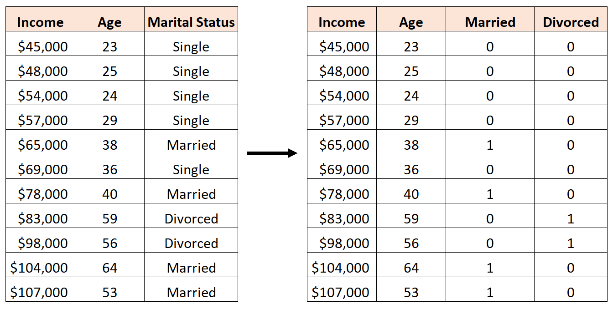

# Introduction

```{r, echo=FALSE}
knitr::include_graphics("intro_image.jpg")
```

## Purpose of This Site

The goal of this site is to have a place where you can look for examples of code. Think of this site as a log of all of the topics we cover in class and in lab sessions. I will make updates throughout the semester as we cover more advanced material. I hope this proves to be a helpful and beneficial resource and offer an easier to access format than the Google Doc. 

Let me know if any of this code doesn’t run correctly or if you have any questions or issues!

## Loading Data

The easiest way to load data into R and ensure you have the correct file path is to create a folder on your computer for each assignment and place the datasets directly into that folder.

1. Create a folder on your computer for each new analysis

2. Download your Data and move the file to your newly created folder

3. Then open RStudio

4. Click the project button in the top right corner

5. Click new project

6. Click existing directory

7. Click browse and find the folder that you created

8. Click create project

9. Once your new project opens, click the blank page with a green plus sign icon in the top left corner under the file option

10. Click R script to open a new script

11. You should also be able to see your data file in the bottom right window of RStudio, click the file and follow the options depending on the file type

12. Once your data is imported into R, the code that R automatically ran will be in the console window on the bottom left, copy and paste it to your fresh R script
  - For example, in Lab 1, my code looked like: `read_excel("Data/USstates.xlsx")`

13. Run this copy and pasted line of code whenever you open the R Project and you will never have to worry about complicated file pathing commands

14. I recommend using the assignment operator `<-` to give  your dataset a short and simple name like `df`, `dta`, or, if you are working with multiple datasets, name each something short and descriptive


# 9/23 | Lab I: Tidyverse & OLS Review

```{r, echo=FALSE}
knitr::include_graphics("lab_1_image.png")
```

```{r, include=TRUE, message = FALSE, warning = FALSE}
# Preparation
library(tidyverse)
library(readr)
library(readxl)
library(stargazer)
library(car)
```

## Join the data sets.
- Join the cases and vaccination data by date and state.
    - Case data: [United_States_COVID-19_Cases_and_Deaths_by_State_over_Time.csv](# https://data.cdc.gov/Case-Surveillance/United-States-COVID-19-Cases-and-Deaths-by-State-o/9mfq-cb36)

    - Vaccination data: [COVID-19_Vaccinations_in_the_United_States_Jurisdiction.csv](https://data.cdc.gov/Vaccinations/COVID-19-Vaccinations-in-the-United-States-Jurisdi/unsk-b7fc)

    - Other state variables: USstates.xlsx

- Add the USstates.xlsx data and limit your dataframe to the states listed in USstates.xlsx.  
- How do you know if your merge was successful?


```{r, warning=FALSE, message=FALSE}
## Loading Case Data
case <- read_csv("Data/United_States_COVID-19_Cases_and_Deaths_by_State_over_Time.csv")

## Loading Vax Data 
vax <- read_csv("Data/COVID-19_Vaccinations_in_the_United_States_Jurisdiction.csv")

## Joining Case & Vax
case_vax <- case %>%
  left_join(vax, by = c("submission_date" = "Date", "state" = "Location"))

## Adding in state variables
states <- read_excel("Data/USstates.xlsx")

## Joining all datasets to create df
df <- case_vax %>%
  filter(state %in% states$stateAbbr) %>%
  left_join(states, by = c("state" = "stateAbbr")) %>%
  janitor::clean_names() ## making variable names lowercase with underscores

## Checking for only states
count(tibble(unique(df$state)))

## View(df)

```

To use `janitor::clean_names()` above, be sure to install the `janitor` package with `install.packages("janitor")`

## Create and add the following variables to your dataframe density, deaths per capita, cases per capita and vaccinated percent.

- For a specific day, show the top five states ranked by deaths per capita and calculate the average vaccinated per capita and the mean, minimum and maximum deaths per capita.

```{r, warning=FALSE, message=FALSE}
## Creating Variables
df <- df %>% 
  mutate("deaths_pc" = 100000*new_death/pop2019, 
         "cases_pc"  = 100000*new_case/pop2019,
         "vaxed_pct"  = series_complete_12plus_pop_pct/100,
         "density"   = pop2019/(1000000*sq_miles))

## Filtering to specific day
df_day <- df %>%
  filter(submission_date == "10/1/2021")

## Top five states by deaths per capita
df_day %>%
  arrange(desc(deaths_pc)) %>%
  dplyr::select(submission_date, state, deaths_pc, cases_pc, vaxed_pct, density) %>%
  slice(1:5)

## Mean vaxed per capita and mean, min, max of deaths per capita
df_day %>%
  summarise(mean_vaxed = mean(vaxed_pct),
            mean_deaths = mean(deaths_pc),
            min_deaths = min(deaths_pc),
            max_deaths = max(deaths_pc))

```

## Estimate three regression models with deaths per capita on your selected day as the dependent variable.
- Your first model will have only Trump 2020 percent as an independent variable.
- Your second model will add vaccinated percent as an independent variable.
- Your third model will add density.
- Before you estimate the models, write down your expectations about what will happen in these models.

```{r, message=FALSE, warning=FALSE}
## Trump percent model
ols.1 <- lm(deaths_pc ~ trump2020_percent, data = df_day)
summary(ols.1)

## Trump and Vax model
ols.2 <- lm(deaths_pc ~ trump2020_percent + vaxed_pct, data = df_day)
summary(ols.2)

## Trump, Vax, and Density Model
ols.3 <- lm(deaths_pc ~ trump2020_percent + vaxed_pct + density, data = df_day)
summary(ols.3)
```

The results of `ols.1`, using October 1st, 2021 as the day, indicate that area with higher support for Donald Trump have more deaths per capita, specifically, a one percentage increase in Trump's 2020 vote share, on average, increases deaths per capita by 1.6. This is a classic case of omitted variable bias, however. Once we control for the percent vaxed in an area, the `trump2020_percent` loses statistical significance. We can see in the second model that the coefficient on the Trump vote share variable greatly decreases and is no longer statistically significant at conventional thresholds. `vaxed_pct` is statistically significant at the $p<.05$ level and indicates that a one percent increase in an areas vaccination rate corresponds, on average, with a 1.9 decrease in deaths per capita, holding `trump2020_percent` constant. This result stands even when controlling for an areas density as shown in model 3.

## Assess specific vaccines
- Create and add vaccinated percent by state for each of the Pfizer, Modern and Janssen (which is Johnson and Johnson) vaccines.
- Use _pop2019_ for population
- Use Series\_Complete\_Moderna\_18Plus, Series\_Complete\_Janssen\_18Plus and Series\_Complete\_Pfizer\_18Plus for the vaccination totals.

- Estimate a model in which deaths per capita is a function of all three vaccination rates.

- Explain what the results mean, especially in light of the results above for overall vaccination results.

- Explain how one would compare the efficacy of the individual vaccines (e.g., whether the Moderna vaccine works better than the Johnson and Johnson vaccine). Many answers would work here.

```{r, message=FALSE, warning=FALSE}
## Creating vaxed percent variables for different vaccines
df <- df %>% 
  mutate(vaxed_pct_moderna  = series_complete_moderna_18plus/(100*pop2019),
         vaxed_pct_jans  = series_complete_janssen_18plus/(100*pop2019),
         vaxed_pct_pfizer  = series_complete_pfizer_18plus/(100*pop2019))

## Filtering to day
df_day = df %>% 
  filter(submission_date == "10/1/2021")

## Running Model
ols.4 <- lm(deaths_pc ~ vaxed_pct_jans + vaxed_pct_moderna +
             vaxed_pct_pfizer, data = df_day)
summary(ols.4)
```

```{r echo = FALSE, results = 'asis', collapse = TRUE}
## Outputting Final Model
stargazer(ols.1, ols.2, ols.3, ols.4,
          keep.stat = c("n","ser", "rsq", "f"),
          report = "vcst", header = FALSE, type="html",
          column.labels = c("Model 1", "Model 2", "Model 3", "Model 4"),
          digits = 3, title = "Lab I OLS Results",
          dep.var.caption = "", dep.var.labels.include = FALSE)
```

The results are no longer statistically significance due to multicollinearity. There is a high degree of correlation between the rates each vaccine were administered which is contributing to the large standard errors. The p-value of the $F$-statistic tells us the probability that we would see a result this extreme given all of the coefficients on the vaccines are actually zero, reinforcing our findings above. 

This is not necessary for this lab, but to assess the efficacy of one vaccine over another, we could conduct an $F$ test. Remember, the formula for F-tests is: $$F_{q, N-k} = \frac{(R^2_{Unrestricted}-R^2_{Restricted})\setminus q}{(1-R^2_{Unrestricted}) \setminus (N-k)}$$

As an example, I will evaluate if $\beta_1 = \beta_2$ in the following model: $deaths_pc_{it} = \beta_0 + \beta_1jans_{it} + \beta_2moderna_{it} + \beta_3pfizer_{it} + \epsilon_i$ which is `ols.4` estimated above that examines the relationship between the rate of vaccination for each vaccine and deaths per capita in state $i$ and day $t$. We can do this manually, but `library(car)` makes it easy. See the code below:

```{r, warning=FALSE, message=FALSE}
## F Test 
linearHypothesis(ols.4, c("vaxed_pct_jans = vaxed_pct_moderna"))
```

We can see that the $p$-value is not statistically significant, meaning that we cannot reject the null hypothesis that $\beta_1$ is statistically significantly different than $\beta_2$.

## Optional Lab 1b

This lab is optional and just for some additional practice.

### Load the World Values Survey data from "Data/WV7_small.csv" and the CountryCode data from "Data/Country codes for WVS wave 7.csv".
The codebook for the World Values Survey data is available at 
http://www.worldvaluessurvey.org/WVSDocumentationWV7.jsp

The variables in WV_small were created as follows:

- Satisfaction with your life from 1 (completely dissatisfied) to 10 (completely satisfied) (*V23*)
- Income: a country-specific scale ranging from 1 (lowest income category) to 10 (highest income category) (*V239* in the dataset)
- Education: a scale ranging from 1 (no formal education) to 9 (a degree from a university) (*V248* in the dataset)
- Country: based on *V2* in the dataset.  See “Country codes for WVS wave 6.csv”
- Conservatism: self-identified political conservatism from 1 (most liberal) to 10 (most conservative) (*V95* in the data set)
- Male: a dummy variable indicating male (*V240*)
- Religious: Indicating how often the individual attends religious services ranging from 1 (almost never) to 7 (more than once a week) (this is a re-coding of *V145* that had the polarity reversed, but is harder to interpret)
- Marital: Marital status 1 = Married 2 = Living together as married 3 = Divorced 4 = Separated 5 = Widowed 6 = Single
- Survey year: year survey taken
- Birth year: respondent's year of birth

```{r, warning=FALSE, message=FALSE}
## World Values Dataset
wv <- read_csv("Data/WV7_small.csv")

## Country Codes
cc <- read_csv("Data/Country codes for WVS wave 7.csv")
```


### Join the country name from the CountryCode data to the World Values data.  The country code is *V2* in CountryCode and *B_Country* in the World Values data.  Create two data objects of the countries in and not in the World Values data. Display the first 10 countries for each list.

```{r, warning=FALSE, message=FALSE}
## Left Join
wv <- wv %>%
  left_join(cc, by = c("B_COUNTRY" = "V2"))

## Showing countries in
countries_in_wv <- tibble(unique(wv$country))
countries_in_wv[1:10,]

## Anti Join
countries_out <- cc %>%
  anti_join(wv, by = c("V2" = "B_COUNTRY")) %>%
  filter(V2 > 0)

## Countries not in wv
countries_out %>%
  slice(1:10)
```

### Using pipes, calculate the percent immigrant in every country. Show the highest 10 and lowest 10 countries. (Be sure to think through what the variable in the data set means.) 

```{r, warning=FALSE, message=FALSE}
## Recoding Immigrant Variable
wv$Immigrant <- wv$Immigrant-1

## 10 Highest
wv %>%
  group_by(country) %>%
  summarize(pct_imm = mean(Immigrant, na.rm=T), n=n())%>%
  arrange(desc(pct_imm)) %>%
  slice(1:10)

## 10 Lowest
## Percent immigrant in each country
wv %>%
  group_by(country) %>%
  summarize(pct_imm = mean(Immigrant, na.rm=T), n=n())%>%
  arrange(pct_imm) %>%
  slice(1:10)

```


### We're now going to give some examples of the kind of data we can calculate.  Think about how you would do this in Excel (but don't actually do it!) and then calculate in R. Calculate the percent of immigrants who are men, by country and show the highest and lowest 10 countries.

```{r, message=FALSE, warning=FALSE}
## 10 Highest
wv %>%
  filter(Male==1) %>%
  group_by(country) %>%
  summarize(pct_imm = mean(Immigrant, na.rm=T), n=n()) %>%
  arrange(desc(pct_imm)) %>%
  slice(1:10)

## 10 Lowest
wv %>%
  filter(Male==1) %>%
  group_by(country) %>%
  summarize(pct_imm = mean(Immigrant, na.rm=T), n=n()) %>%
  arrange(pct_imm) %>%
  slice(1:10)
```


### Group by marital status and country and show the percent of people in each category who are men.  Show the results for a country of your choice and briefly discuss what it means when the percentages in each category are not roughly 50 percent. Recall that the coding for the *Marital* variable is 1 = Married 2 = Living together as married 3 = Divorced 4 = Separated 5 = Widowed 6 = Single.

```{r, message=FALSE, warning=FALSE}
wv %>%
  group_by(country, Marital) %>%
  summarize(male_pct = mean(Male, na.rm=T), n=n()) %>%
  filter(country == "United States")

```


### Come up with your own alternatives: think about some possible subset of people and some information we have about them and see if you can write code to capture that information.

```{r, warning=FALSE, message=FALSE}
wv %>%
  group_by(country, Income) %>%
  summarize(imm_pct = mean(Immigrant, na.rm=T), n=n()) %>%
  filter(country == "United States")

```

# 9/30 | Lab II: Dummy Variables & Career Data

```{r, echo=FALSE}

```

```{r}
## Packages
library(knitr)
library(car)
library(AER)
library(stargazer)

## Data
load("~/GOVT702/Data/Ch6_Lab_CareerHappiness.RData")
```

We will use General Social Survey data for this lab.
The key variables we will use are

 - happy: 3 very happy, 2 pretty happy, 1 not too happy
 - married: 1 for currently married (based on dta$marital, which is 1 for married, 2 for widowed, 3 for divorced, 4 for separated, 5 for never married)
 - sex: 1 for men, 2 for women
 - edcat: 1 for less than high school, 2 for high school, 3 for some college and 4 for college graduate
 - race: 1 for white, 2 for black, 3 for other races (self-identified, first race mentioned)

### Use OLS to estimate the difference in happiness (the "happy" variable) for married versus unmarried people.  Then use the t test function to assess the difference in happiness by gender (see the Computing Corner in Chapter 6 of the book). Discuss similarities and differences in OLS model and t test function results

```{r}
## Difference in Happiness with OLS
model_1 <- lm(happy~married, data=dta)
summary(model_1)
confint(model_1)

## With t.test()
t.test(dta$happy[dta$married==1], dta$happy[dta$married==0])
```

### Use OLS with robust standard errors to estimate the difference in happiness for married and unmarried people.  Then use the t test function with unequal variances to assess the difference in happiness by marital status.  Discuss similarities and differences in OLS model and t test function results.

```{r}
## model_1 with Robust Standard Errors
coeftest(model_1, vcov. = vcovHC(model_1, type = "HC1"))

# t-test, without assuming equal variance
t.test(dta$happy[dta$married==1], dta$happy[dta$married==0], var.equal = FALSE)
```

### Create an interaction between married and age.  Estimate a model that explains happiness as a function of age and marital status, allowing for the age effect to differ according to marital status.   (For simplicity, we use only married and unmarried for marital status.)  What is the effect of age for unmarried people?  For married people?

```{r}
## Interaction Term
dum_interact <- dta$married*dta$age

## Model 2
model_2 <- lm(happy~age + married + dum_interact, data=dta)
summary(model_2)

## or
model_2b <- lm(happy~married*age, data=dta)
summary(model_2b)
```

The effect of age is $-0.00281$ for unmarried people and  $-0.00281 +  0.002350 =  -0.0004699$ for married people. The intercept is $2.13$ for unmarried people and $2.13 + 0.2109 = 2.3409$ for married people.

### Estimate separate models explaining happiness in terms of age for married and unmarried people.  Comment on similarities and differences compared to results immediately above for (i) the estimated effect of age and (ii) the intercept.

```{r}
## Model 3a
model_3a <- lm(happy~age, data=subset(dta, married==1))
summary(model_3a)

## and
model_3b <- lm(happy~age, data=subset(dta, married==0))
summary(model_3b)

```

The results here are the same as above: for unmarried people, the effect of age is $-0.00281$ and the intercept is $2.130$.

The effect of age for married people also the same: $-0.000469$, with an intercept of $2.3409$.


### Marianne Bertrand wrote an article called ``Work on Women’s Work is Never Done: Career, Family, and the Well-Being of College-Educated Women'' published in the *American Economic Review: Papers & Proceedings* 2013, 103(3): 244–250.  She analyzed the effect of careers and family on college-educated women. She defines a career variable that is 1 if someone's earnings are above the twenty-fifth percentile in the relevant year and age group. Estimate a model in which happiness is a function of career, being married and an interaction of career and married ("careermarried"). To match Betrand's analysis, limit the data to only to college educated (dta\$educat==4) women (dta\$sex==2). Interpret the estimated average happiness for the four types of women implied by this analysis.

```{r}
model_4 <- lm(happy ~ career*married, data=dta[dta$sex==2 & dta$educat==4,])
summary(model_4)

```

The four groups are unmarried women without careers, married women with careers, married women without
careers, and unmarried women without careers.

College-educated women that have no careers and are not married have an average happiness of $2.12$.

College-educated women with careers but not married have an average happiness of $2.12 + 0.09 = 2.21$.  

College-educated women with no career but are married have average happiness of $2.12 + 0.29 = 2.41$.  

College-educated women that are both married and have careers have average happiness of $2.12 + 0.092 + 0.29 -0.099 = 2.4$.

### The GSS provides a race variable (dta$race).  The variable equals 1 for white respondents, 2 for black respondents and 3 for everyone else.  Add race to the above model and interpret the coefficients related to race. Estimate another model with a different reference category and explain coefficients across the two models.

```{r}
## First Race Model with White as Reference
model_5 <- lm(happy ~ career*married + factor(race),
data=dta[dta$sex==2 & dta$educat==4,])
summary(model_5)

## Second Race Model with Other as the Reference Category
model_5b <- lm(happy ~ career*married + relevel(factor(race), ref = "3"),
data=dta[dta$sex==2 & dta$educat==4,])
summary(model_5b)

```

Both results indicated white college-educated women are both $0.16$ higher on the happiness variable than African-American college-educated women and $0.10$ higher than other college-educated women of other races. Even though the coefficient on the other race variables change across specifications, our interpretation of the results does not change; the change is due solely to the change in reference category.

### Estimate a model similar to the above, but for a different group of your choice (e.g., limit by race or gender or education) and feel free to include different covariates.

No wrong answers here (mostly)

This model explores the how commute times affect happiness. I specifically think that time commuting will - conditionally - lower a person’s happiness if it means they are away from their families. Because of this, I create an interaction term between commuting and marriage and estimate the effects.

```{r}
## Commuting Model on Adults
model_6 <- lm(happy ~ commute*married, data=dta[dta$age>18,])
summary(model_6)

```

My theory is not supported by this model. I found no significant effect for those who commute longer and no significant conditional effect of happiness for those who commute long hours and are married. I did find support that marriage in general makes a person happier, though this should not be considered a causal effect.
